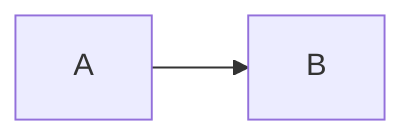
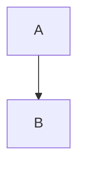
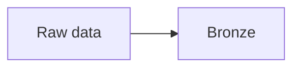
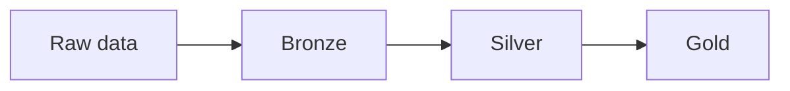
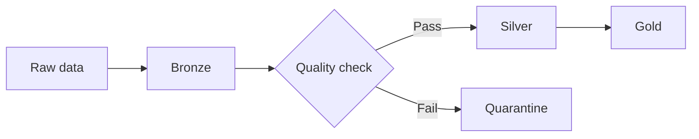
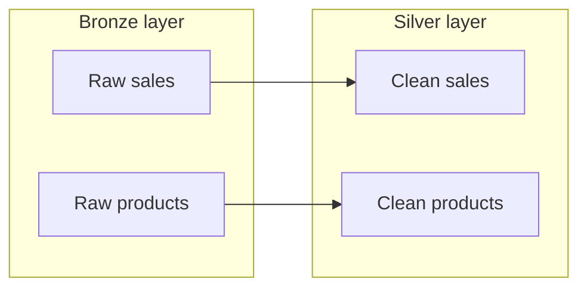

# Creating Architecture Diagrams with Mermaid

## 1. Mermaid turns text into a diagram 

Show this:

```text
flowchart LR
    A --> B
```


!!! note "Mermaid is just text. The arrows describe relationships."


## 2. Direction matters 

Change `LR` to `TD`:

```text
flowchart TD
    A --> B
```


```text
LR = left to right
TD = top down
```

## 3. Nodes need meaningful labels 

```text
flowchart LR
    A[Raw data] --> B[Bronze]
```


```text
A is the internal name
[Raw data] is what appears on the diagram
```

## 4. One arrow per relationship 

```text
flowchart LR
    Raw[Raw data] --> Bronze[Bronze]
    Bronze --> Silver[Silver]
    Silver --> Gold[Gold]
```


Avoid shortcuts like `A --> B & C` at this stage.

## 5. Add one architecture decision

```text
flowchart LR
    Raw[Raw data] --> Bronze[Bronze]
    Bronze --> Check{Quality check}
    Check -->|Pass| Silver[Silver]
    Check -->|Fail| Quarantine[Quarantine]
    Silver --> Gold[Gold]
```


!!! question "QUESTION: What does this diagram show that the simple Bronze -> Silver -> Gold diagram did not show?"

---

## Extra: Subgraphs for layers

```text
flowchart LR
    subgraph Bronze["Bronze layer"]
        RawSales[Raw sales]
        RawProducts[Raw products]
    end

    subgraph Silver["Silver layer"]
        CleanSales[Clean sales]
        CleanProducts[Clean products]
    end

    RawSales --> CleanSales
    RawProducts --> CleanProducts
```


!!! info "Mermaid also renders natively in GitHub `.md` files - and later today you will store your diagram in GitHub."
