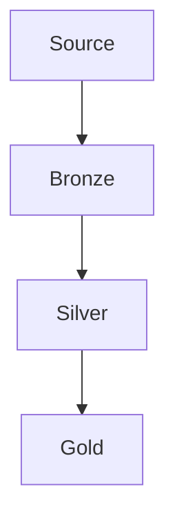
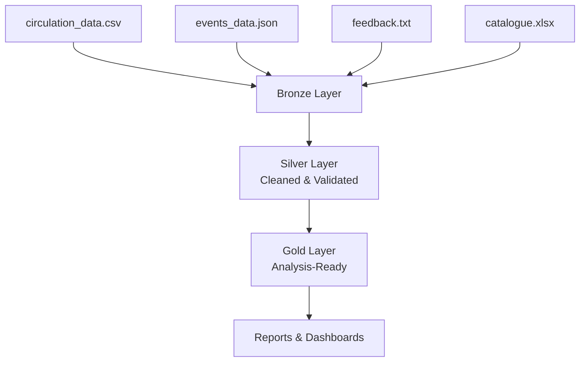

# Creating Architecture Diagrams with Mermaid

Mermaid is built into GitHub - any `.md` file in a repo renders Mermaid diagrams automatically. No tools to install.

## Basic syntax

````markdown

````

## Demo: Library pipeline

Show this rendering in the repo README:

````markdown

````

## Key points

- `TD` = top-down flow. Use `LR` for left-right if it fits better
- Square brackets `[]` for process steps, `()` for rounded, `{}` for decisions
- Edit in the repo, preview renders on GitHub instantly
- They'll add this to their README during the DESIGN activity
