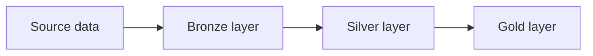

# Activity: Design your Pipeline Architecture

Work as a group to create a Mermaid diagram of your pipeline architecture. Your trainer will share a HedgeDoc link for your group.

## Include

- Your four data sources
- Bronze, Silver and Gold layers
- The flow between them

## Example structure

````markdown

````

!!! success "Keep it simple - sources in, layers through, outputs out. You can add detail later."
