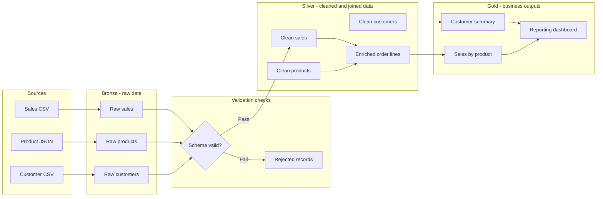

# Possible solution



```text
flowchart LR
    subgraph Sources
        SalesCSV[Sales CSV]
        ProductJSON[Product JSON]
        CustomerCSV[Customer CSV]
    end

    subgraph Bronze["Bronze - raw data"]
        BronzeSales[Raw sales]
        BronzeProducts[Raw products]
        BronzeCustomers[Raw customers]
    end

    subgraph Quality["Validation checks"]
        CheckSchema{Schema valid?}
        Quarantine[Rejected records]
    end

    subgraph Silver["Silver - cleaned and joined data"]
        CleanSales[Clean sales]
        CleanProducts[Clean products]
        CleanCustomers[Clean customers]
        OrderLines[Enriched order lines]
    end

    subgraph Gold["Gold - business outputs"]
        SalesByProduct[Sales by product]
        CustomerSummary[Customer summary]
        Dashboard[Reporting dashboard]
    end

    SalesCSV --> BronzeSales
    ProductJSON --> BronzeProducts
    CustomerCSV --> BronzeCustomers

    BronzeSales --> CheckSchema
    BronzeProducts --> CheckSchema
    BronzeCustomers --> CheckSchema

    CheckSchema -->|Fail| Quarantine
    CheckSchema -->|Pass| CleanSales

    CleanSales --> OrderLines
    CleanProducts --> OrderLines
    CleanCustomers --> CustomerSummary

    OrderLines --> SalesByProduct
    CustomerSummary --> Dashboard
    SalesByProduct --> Dashboard
```
