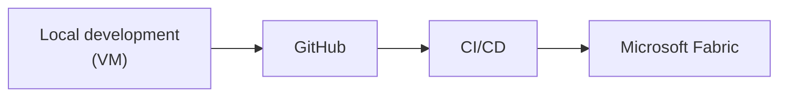

# Your Mission

Build a production-ready data quality pipeline for Newham Public Library.

## What you're building

A pipeline that:

- Ingests data from four sources (CSV, JSON, text, Excel)
- Cleans and validates it automatically
- Produces analysis-ready outputs in a gold layer
- Runs reliably without manual intervention

## How you'll build it

Over four days you'll move from writing the first function on your VM to a fully deployed, tested pipeline running in Fabric.

## What comes next

Now you know what you're building - the next step is to design how it's structured. That means thinking about the architecture before writing a single line of code.

