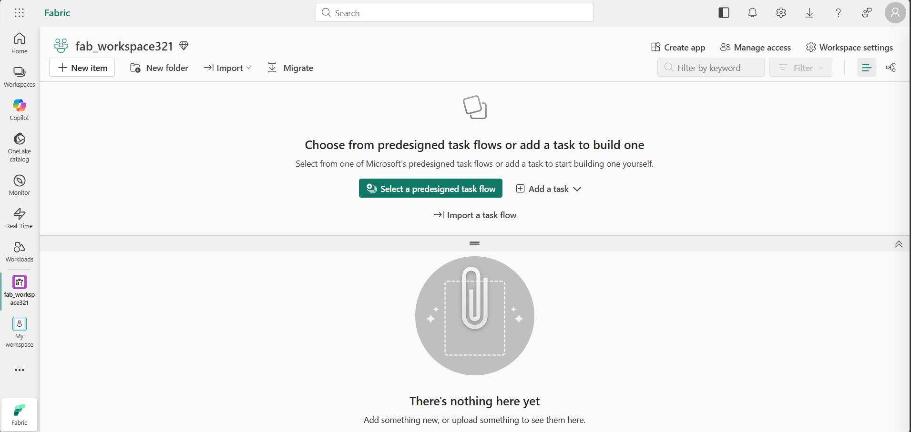
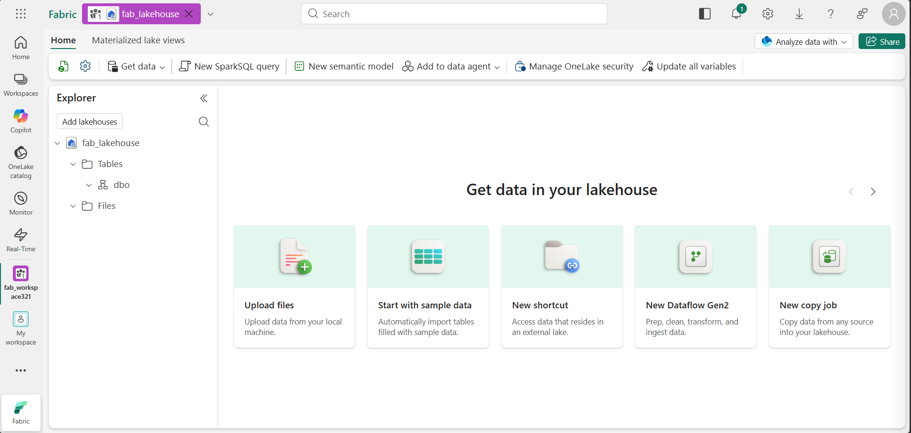
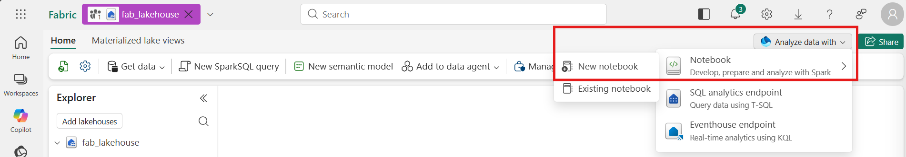

# Library Pipeline in Fabric

In this lab, you will run a real Python package - the one you built and tested yourself - inside Microsoft Fabric. You will land raw library data in **bronze**, clean it with your own package code to produce **silver**, then build a **gold** table that answers a business question.

!!! info "This lab continues from [32 Create Fabric Lakehouse](32-lakehouse.md). You should already be logged on to the Microsoft Fabric Playground."


## Step 1: Create a workspace

1. In the navigation pane on the left, select **Workspaces** (the icon looks similar to &#128455;).

2. Select **+ New workspace**, then create a workspace using the naming format below:

    - Start the name with `lib_workspace`
    - Add random numbers to make it unique (for example, `lib_workspace123`)
    - Leave all other options as the default values
    - Click **Apply**

    !!! abstract ""
        


## Step 2: Create a lakehouse

1. On the menu bar on the left, select **Create**. In the *New* page, under the *Data Engineering* section, select **Lakehouse**.

    - Name the lakehouse: `library_pipeline`

    !!! tip "If the **Create** option is not pinned to the sidebar, you need to select the ellipsis (…) option first."

    After a minute or so, a new empty lakehouse will be created.

    !!! abstract ""
        


## Step 3: Create the bronze layer

The bronze layer holds raw data exactly as it arrived - no modifications.

1. In the **Explorer** pane, click the **...** menu for the **Files** folder and select **New subfolder**.

    - Name the subfolder: `bronze`

2. Click the **...** menu for the `bronze` folder and select **Upload** > **Upload files**.

3. Locate the following files in the `data/` folder of the `library-pipeline-runner` repo you cloned this morning and upload both:

    - `circulation_data.csv`
    - `events_data.json`

4. Select the `bronze` folder and confirm both files are visible.

    !!! tip "If the files do not automatically appear, select **Refresh** from the **...** menu."

    !!! note "Bronze is read-only by convention"
        Never write transformed data into the bronze folder. If you need to re-run the pipeline from scratch, bronze is your guaranteed clean starting point.


## Step 4: Create the Bronze to Silver notebook

*Silver is where raw data becomes trusted - using the same package you built and tested locally, now running in the cloud.*

1. At the top-right of the Lakehouse page, select the **Analyze data with** dropdown and choose: **Notebook** > **New notebook**.

    !!! quote ""
        

2. Select the notebook name at the top of the page and rename it to `Library Pipeline - Bronze to Silver`.

Work through the following cells in order, adding each one and running it before moving to the next.

### Cell 1 - Install your package from GitHub

Paste the following into the first cell and run it. Replace the URL with the address of your own GitHub repo (find it on GitHub under **Code** -> **HTTPS**).

```python
# Cell 1 - Install
%pip install "git+https://github.com/YOUR_USERNAME/YOUR_REPO_NAME.git"
```

### Cell 2 - Import your functions

Paste the following into the second cell and run it:

```python
# Cell 2 - Import
import pandas as pd

from data_processing.ingestion import load_csv, load_json
from data_processing.cleaning import (
    remove_duplicates,
    handle_missing_values,
    standardise_dates,
)

print('Package installed and imported successfully')
```

### Cell 3 - Load circulation data from bronze

Add a new cell and run it:

```python
# Cell 3 - Load
df = load_csv('/lakehouse/default/Files/bronze/circulation_data.csv')

print(f'Bronze: {len(df)} rows')
print(df.head())
```

### Cell 4 - Clean circulation data

Add a new cell and run it. This calls the same cleaning functions you wrote and tested on Day 2.

```python
# Cell 4 - Clean
df = remove_duplicates(df, subset=['transaction_id'])
df = handle_missing_values(df, strategy='drop')
df = standardise_dates(df, ['checkout_date', 'return_date'])

# Force real datetime dtype, regardless of how standardise_dates() formatted these
df['checkout_date'] = pd.to_datetime(df['checkout_date'])
df['return_date'] = pd.to_datetime(df['return_date'])

print(f'Silver: {len(df)} rows')
```

!!! note "Why the explicit `pd.to_datetime` calls?"
    `standardise_dates()` is a function you wrote on Day 2, so its output format may differ between students. Forcing both date columns to a real `datetime` dtype here guarantees they are saved as proper date columns in the Delta table, which the gold layer query in Step 7 depends on.

### Cell 5 - Validate before saving

Add a new cell and run the following validation checks - never save data you have not verified:

```python
# Cell 5 - Validate
assert len(df) > 0, 'no rows left after cleaning'
assert df['transaction_id'].is_unique, 'transaction_id should be unique'
assert df['member_id'].isnull().sum() == 0, 'member_id should have no nulls'
assert df['branch_id'].isnull().sum() == 0, 'branch_id should have no nulls'
assert pd.api.types.is_datetime64_any_dtype(df['checkout_date']), 'checkout_date should be a date'

print('All validation checks passed')
print(df.dtypes)
```

### Cell 6 - Write silver_circulation

Add a new cell and run it:

```python
# Cell 6 - Write
spark.createDataFrame(df).write.mode('overwrite').saveAsTable('silver_circulation')

print('Saved: silver_circulation')
```

### Cell 7 - Load and flatten events data

Add a new cell and run it. `load_json()` flattens the nested `attendance` structure automatically.

```python
# Cell 7 - Load events
events = load_json('/lakehouse/default/Files/bronze/events_data.json')

print(f'Bronze: {len(events)} events')
print(events.columns.tolist())
```

### Cell 8 - Write silver_events

Add a new cell and run it:

```python
# Cell 8 - Write
spark.createDataFrame(events).write.mode('overwrite').saveAsTable('silver_events')

print('Saved: silver_events')
```

!!! success "Refresh the **Tables** pane - `silver_circulation` and `silver_events` should now be listed."

After running all eight cells, on the toolbar use the :material-stop: (*Stop session*) button to stop the Spark session.


## Step 5: Explore the silver layer

Silver is the trust boundary - anyone querying these tables knows the data has been cleaned and validated.

1. In the left navigation bar, select your **library_pipeline** lakehouse.

2. Select **Analyze data with** and choose **SQL analytics endpoint**.

3. Run the following queries to explore the silver tables:

    ```sql
    SELECT branch_id, COUNT(*) AS loans, COUNT(DISTINCT member_id) AS members
    FROM silver_circulation
    GROUP BY branch_id
    ORDER BY loans DESC
    ```

    ```sql
    SELECT branch, COUNT(*) AS events, ROUND(AVG(feedback_score), 2) AS avg_feedback
    FROM silver_events
    GROUP BY branch
    ORDER BY events DESC
    ```


## Step 6: Create the Silver to Gold notebook

Gold answers a specific business question. It is always built from silver - never from bronze directly.

1. In the left navigation bar, return to your **library_pipeline** lakehouse.

2. On the **Home** tab, select **Open notebook** > **New notebook**.

3. Select the notebook name at the top of the page and rename it to `Library Pipeline - Silver to Gold`.

    !!! warning "If you receive a `TooManyRequestsForCapacity` error when running the first cell:"
        Make sure you stopped the session in the Bronze to Silver notebook before continuing.

### Cell 1 - Create gold_circulation_summary

Paste the following into the first cell and run it:

```sql
%%sql
CREATE OR REPLACE TABLE gold_circulation_summary AS
SELECT
    branch_id,
    DATE_TRUNC('month', checkout_date) AS month,
    COUNT(*) AS total_loans,
    COUNT(DISTINCT member_id) AS unique_members
FROM silver_circulation
GROUP BY branch_id, DATE_TRUNC('month', checkout_date)
ORDER BY month, branch_id
```

!!! note "This gives a business summary per branch per month."

!!! success "Refresh the **Tables** pane - `gold_circulation_summary` should now be listed."


## Step 7: Answer the business question

1. In the left navigation bar, select your **library_pipeline** lakehouse.

2. Select **Analyze data with** and choose **SQL analytics endpoint**.

3. Run the following query:

    ```sql
    SELECT branch_id, month, total_loans, unique_members
    FROM gold_circulation_summary
    ORDER BY month, branch_id
    ```

4. Right-click `gold_circulation_summary` in the **Tables** list and select **New report**.

5. Drag:

    - `month` to the X axis
    - `total_loans` as a line or bar chart

    !!! success "You have created a Gold layer table with a visualisation, built entirely from your own package code."


## Discussion

- You now have three layers. What does each one protect you against?
- If `gold_circulation_summary` looked wrong, where would you investigate first?
- The cleaning logic in Cell 4 is the exact code you wrote and tested on Day 2 - what does that buy you, compared to writing fresh cleaning code inside the Fabric notebook?
- What would need to change if a new library branch opened next month?

---

## Clean up resources

In this exercise, you ran your own Python package inside Microsoft Fabric to build a medallion architecture: bronze for raw circulation and events data, silver for cleaned and validated tables, and gold for a business-ready summary.

Once you have finished exploring, you should delete the workspace you created for this exercise.

1. Navigate to Microsoft Fabric in your browser.

2. In the bar on the left, select the icon for your workspace to view all of the items it contains.

3. Select **Workspace settings** and in the **General** section, scroll down and select **Remove this workspace**.

4. Select **Delete** to delete the workspace.
