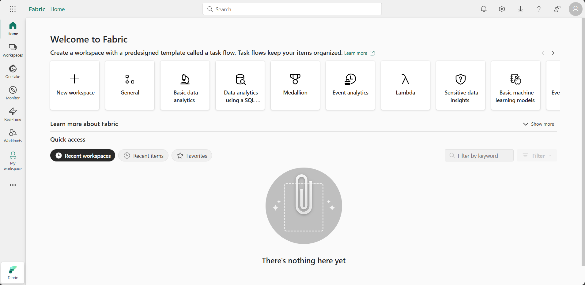
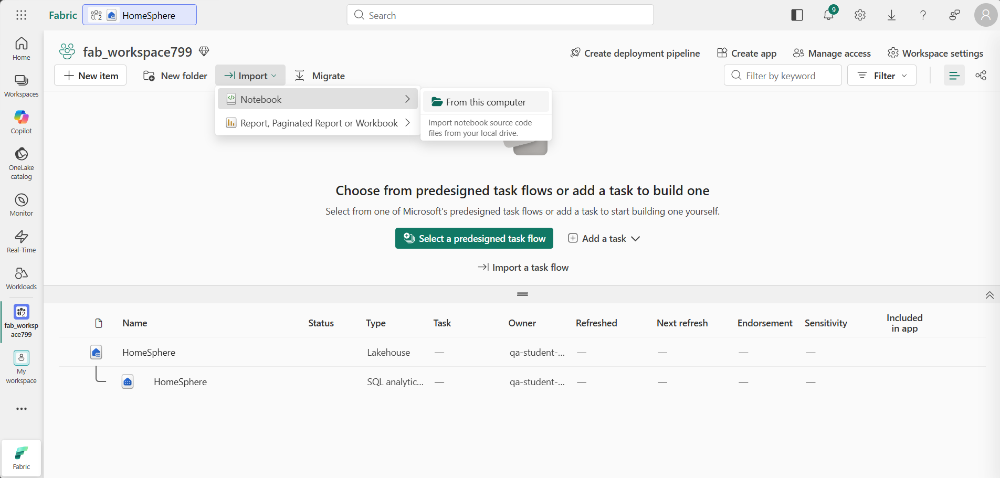

# Library Pipeline Orchestration

Yesterday you ran two notebooks by hand in Microsoft Fabric - one cell at a time. In this lab you will do the same job with a single click: a **pipeline** that runs both notebooks in sequence, on demand, as many times as you like.

## Step 1: Start the Microsoft Fabric Playground

1. Navigate to the [QA Platform](https://bud.sso.app.qa.com/lab/microsoft-fabric-playground/) to access the **Microsoft Fabric Playground**.

2. Click **Start** to start the lab.

3. Make a note of your allocated **username** and **password**.

!!! warning "Wait until the lab status shows **Ready**, before continuing with the next step!"

!!! tip "Switch to your Virtual Machine to complete the steps listed below."


## Step 2: Logon to Azure and Microsoft Fabric

1. In your VM open a **private browsing window** (InPrivate in Edge, Incognito in Chrome).

2. Navigate to the [Microsoft Azure home page](https://portal.azure.com/) at: https://portal.azure.com

3. When prompted, sign in using:

    - **Username** from the QA Platform (used as the email address)
    - **Password** from the QA Platform (used as a Temporary Access Pass)

    - If prompted to "Stay signed in?", select **No**.

    !!! success "You are now signed in to the **Azure portal**. This confirms your lab account is active."

4. In the same private browsing window, **open a new tab**.

5. Navigate to the [Microsoft Fabric home page](https://app.fabric.microsoft.com/home?experience=fabric-developer) at: https://app.fabric.microsoft.com/home?experience=fabric-developer

6. If prompted, **re-enter your email address** to confirm access to Microsoft Fabric.

    !!! abstract ""
        


## Step 3: Create a workspace

1. In the navigation pane on the left, select **Workspaces** (the icon looks similar to &#128455;).

2. Select **+ New workspace**, then create a workspace using the naming format below:

    - Start the name with `lib_workspace`
    - Add random numbers to make it unique (for example, `lib_workspace123`)
    - Leave all other options as the default values
    - Click **Apply**

    !!! abstract ""
        


## Step 4: Create a lakehouse

1. On the menu bar on the left, select **Create**. In the *New* page, under the *Data Engineering* section, select **Lakehouse**.

    - Name the lakehouse: `Library Pipeline`

    !!! tip "If the **Create** option is not pinned to the sidebar, you need to select the ellipsis (…) option first."

    After a minute or so, a new empty lakehouse will be created.

    !!! abstract ""
        


## Step 5: Create the bronze layer

1. In the **Explorer** pane, click the **...** menu for the **Files** folder and select **New subfolder**.

    - Name the subfolder: `bronze`

2. Click the **...** menu for the `bronze` folder and select **Upload** > **Upload files**.

3. Locate `circulation_data.csv` in the `data/` folder of your repo and upload it.

    !!! note "This time you only need `circulation_data.csv` - the events data isn't part of this exercise."

4. Select the `bronze` folder and confirm the file is visible.

    !!! tip "If the file does not automatically appear, select **Refresh** from the **...** menu."


## Step 6: Import the notebooks

!!! info "Rather than building the notebooks cell by cell like yesterday, you will import two ready-made ones from your own repo."

1. In the left navigation bar, select your workspace name to return to the workspace view.

2. On the toolbar select **Import** and click **Notebook**. Then select **From this computer**.

    !!! abstract ""
        

3. Browse to the `notebooks/fabric` folder in your `qa-library-pipeline` repo on the Desktop, and import both:

    - `01_bronze_to_silver.ipynb`
    - `02_silver_to_gold.ipynb`

    !!! success "Both notebooks should now appear as items in your workspace."


## Step 7: Attach the lakehouse and edit Cell 1

1. In the left navigation bar, select your **library_pipeline** lakehouse.

2. Click the **Analyse data with** dropdown in the top right-hand corner (next to the Share button)

    - Select **Notebook** > **Existing notebook**
    - Choose: `01_bronze_to_silver`
    - Click **Open**

3. In the **Notebook Explorer** on the left, select **Data Items**

    - Confirm **library_pipeline** appears under **OneLake**.

4. In **Cell 1**, replace the placeholder URL with the address of your own GitHub repo:

    ```python
    # Cell 1 - Install
    %pip install "git+https://github.com/YOUR_USERNAME/YOUR_REPO_NAME.git"
    ```

    !!! note "This is the only line you need to change in either notebook."

    !!! tip "The notebook will save automatically"


6. Return to the lakehouse and repeat for the second notebook:

    - Click the **Analyse data with** dropdown
    - Select **Notebook** > **Existing notebook**
    - Choose: `02_silver_to_gold`
    - Click **Open**

7. Select **Data Items** in the Notebook Explorer and confirm that **library_pipeline** appears under **OneLake**.

    !!! success "Both notebooks are now connected to the library_pipeline lakehouse."

    !!! tip "You don't need to run either notebook yourself - the pipeline will do that in Step 9."


## Step 8: Build the pipeline

1. Return to your workspace view.

2. Select **New item**, then search for and select **Pipeline**.

3. Name the pipeline: `Library Pipeline`

    - Click **Create**

4. On the pipeline canvas start with a blank canvas:

    - select **Pipeline activity** and choose **Notebook** (under the *Transform* heading).

5. Update General & Settings for this activity:

    - Set the **Name** to: `Bronze to Silver`
    - On the **Settings** tab, configure:
        - **Workspace**: *select your workspace*
        - **Notebook**: select `01_bronze_to_silver`

6. Allow the notebook to import your repo:

    - Still on the **Settings** expand **Base parameters** and click *New*
    - **Name**: `_inlineInstallationEnabled`
    - **Type**: Bool
    - **Value**: `True`

7. Add a second **Notebook** activity to the canvas.

    !!! tip "Look for Notebook on the tool bar or on the Activites tab"

    - Set the **Name** to: `Silver to Gold`
    - On the **Settings** tab, configure:
        - **Workspace**: *select your workspace*
        - **Notebook**: select `02_silver_to_gold`

8. Connect the two activities:

    - Hover over **Bronze to Silver** until a green arrow appears.
    - Drag the arrow onto **Silver to Gold**.

    !!! note "This is an *On success* dependency"
        **Silver to Gold** only runs once **Bronze to Silver** has completed without errors.


## Step 9: Save and Run the pipeline

1. On the **Home** tab, use the :material-content-save: (*Save*) icon to save the pipeline.

2. Use the :material-play: **Run** button to run the pipeline.

3. Monitor progress in the **Output** pane below the canvas, using the :material-refresh: (*Refresh*) icon, until both activities show a green tick.

    !!! success "Both activities should show as **Succeeded**."
        - You can also monitor progress by clicking "Monitor" on the left menu

4. In the left navigation bar, return to your **library_pipeline** lakehouse.

5. Select **Analyze data with** and choose **SQL analytics endpoint**, then run:

    ```sql
    SELECT branch_id, month, total_loans, unique_members
    FROM gold_circulation_summary
    ORDER BY month, branch_id
    ```

    !!! success "The pipeline built this table on its own - no cells, no manual steps."


## Step 10: Run it again

1. Return to the `Library Pipeline` pipeline.

2. Select **Run** again - no edits, no re-typing anything.

3. Watch both activities succeed a second time.

!!! success "Same pipeline, same click, same result - every time you run it."


---

## Clean up resources

In this exercise, you built a Fabric pipeline that ran two notebooks in sequence - the same bronze-to-silver-to-gold process you ran by hand on Day 3, now driven by a single button.

Once you have finished exploring, you should delete the workspace you created for this exercise.

1. Navigate to Microsoft Fabric in your browser.

2. In the bar on the left, select the icon for your workspace to view all of the items it contains.

3. Select **Workspace settings** and in the **General** section, scroll down and select **Remove this workspace**.

4. Select **Delete** to delete the workspace.
